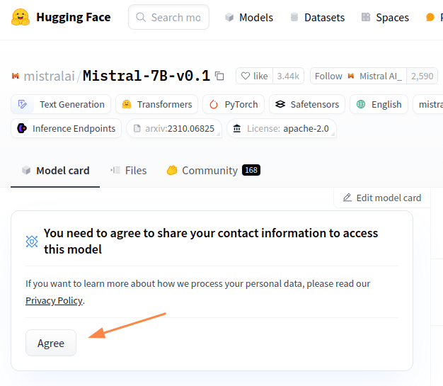
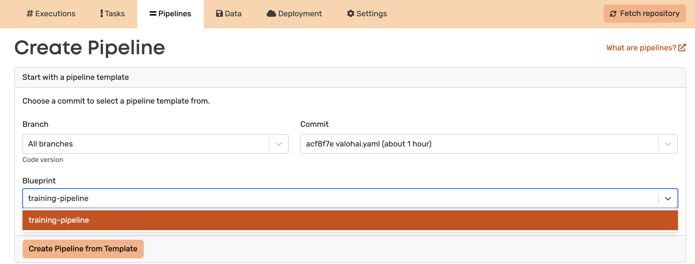

# Mistral Fine-Tuning with Valohai

This project serves as an on-ramp to [Valohai][vh] and is designed to be the first step for individuals starting with their self-serve trial.
The primary goal of this template is to showcase the power of Valohai for fine-tuning large language models, with a special focus on the Mistral 7B model.

[vh]: https://valohai.com/
[app]: https://app.valohai.com
[hf_login]: https://huggingface.co/login
[hf_mistral]: https://huggingface.co/mistralai/Mistral-7B-v0.1

## <div align="center">Overview</div>

### **Data Preprocessing**:

* **Loading Data**:
In our project, data is seamlessly fetched from our S3 bucket. 
When you initiate an execution, the data is automatically stored in the `/valohai/inputs/` directory on the machine. Additionally, the tokenizer is sourced directly from the Hugging Face repository, and it is also available in `/valohai/inputs/` directory.

* **Tokenization**: To make the data suitable for language models, it's tokenized using the tokenizer from Hugging Face's Mistral repository. Tokenization basically means breaking down the text into smaller units, like words or subwords, so that the model can work with it.

* **Saving Processed Data**: After tokenization, the processed data is saved in a way that makes it easy to use later. This processed data is saved to Valohai datasets with a special alias, making it convenient for further steps in the machine learning process.

This streamlined workflow empowers you to focus on your machine learning tasks, while Valohai handles data management, versioning, and efficient storage.

### **Model Fine-Tuning**:

* **Loading Data and Model**: The code loads the prepared training data from Valohai datasets. It also fetches the base model from an S3 bucket. This base model is a pre-trained Mistral model.

* **Model Enhancement**: The base model is enhanced to make it better for training with a method called "PEFT." This enhancement involves configuring the model for better training performance.

* **Training the Model**: The script then trains the model using the prepared data using Trainer from the Transformers library. It fine-tunes the model, making it better at understanding video gaming text.

Saving Results: After training, the script saves checkpoints of the model's progress. These checkpoints are stored in Valohai datasets for easy access in the next steps, like inference.

### **Model Inference**:

In the inference step, we use the fine-tuned language model to generate text based on a given prompt. Here's a simplified explanation of what happens in this code:

* **Loading Model and Checkpoints**: The code loads the base model from an S3 bucket and the fine-tuned checkpoint from the previous step, which is stored in Valohai datasets.

* **Inference**: Using the fine-tuned model and provided test prompt, we get a model-generated response, which tokenizer decodes to make it human-readable.

## <div align="center">Setup</div>

Before we can run any code, we need to set up the project. This section explains how to set up the project using the Valohai web app or the terminal.

<details>
<summary>🌐 Using the web app</summary>

Login to [the Valohai web app][app] and create a new project.

Configure this repository as the project's repository, by following these steps:

1. Go to your project's page.
2. Navigate to the Settings tab.
3. Under the Repository section, locate the URL field.
4. Enter the URL of this repository.
5. Click on the Save button to save the changes.
</details>

<details>
<summary>⌨️ Using the terminal</summary>

To run your code on Valohai using the terminal, follow these steps:

1. Install Valohai on your machine by running the following command:

    ```bash
    pip install valohai-cli
    ```

2. Log in to Valohai from the terminal using the command:

    ```bash
    vh login
    ```

3. Create a project for your Valohai workflow.
Start by creating a directory for your project:

    ```bash
    mkdir valohai-mistral-example
    cd valohai-mistral-example
    ```

    Then, create the Valohai project:
    ```bash
    vh project create
    ```

4. Clone the repository to your local machine:

    ```bash
    git clone https://github.com/valohai/mistral-example.git .
    ```

</details>

<details>
<summary>🌐 / ⌨️ Setup for both</summary>

Authorize the Valohai project to download models and tokenizers from Hugging Face.

1. Login to [the Hugging Face platform][hf_login]

2. Agree on [the terms of Mistral model][hf_mistral]; the license is Apache 2.

    

3. Create an access token under Hugging Face settings.

    

    

    _You can either choose to allow access to all public models you've agreed to or only the Mistral model._

    Copy the token and store it in a secure place, you won't be seeing it again.

    

4. Add the `hf_xxx` token to your Valohai project as a secret named `HF_TOKEN`.

    

    Now all workloads on this project have scoped access to Hugging Face if you don't specifically restrict them.

</details>

## <div align="center">Running Executions</div>

This repository defines the essential tasks or "steps" like data preprocessing, model fine-tuning and inference of Mistral models. You can execute these tasks individually or as part of a pipeline. This section covers how you can run them individually.

<details>
<summary>🌐 Using the web app</summary>

1. Go to the Executions tab in your project.
2. Create a new execution by selecting the predefined steps: _data-preprocess_, _finetune_, _inference_.
3. Customize the execution parameters if needed.
4. Start the execution to run the selected step.
 
     

</details>

<details>
<summary>⌨️ Using the terminal</summary>

To run individual steps, execute the following command:
```bash
vh execution run <step-name> --adhoc
```

For example, to run the preprocess-dataset step, use the command:
```bash
vh execution run data-preprocess --adhoc
```

</details>

## <div align="center">Running Pipelines</div>

When you have a collection of tasks that you want to run together, you create a pipeline. This section explains how to run the predefined pipelines in this repository.

<details>
<summary>🌐 Using the web app</summary>

1. Navigate to the Pipelines tab.
2. Create a new pipeline and select out the blueprint _training-pipeline_.
3. Create a pipeline from template.
4. Configure the pipeline settings.
5. Create pipeline.

    

</details>

<details>
<summary>⌨️ Using the terminal</summary>

To run pipelines, use the following command:

```bash
vh pipeline run <pipeline-name> --adhoc
```

For example, to run our pipeline, use the command:
```bash
vh pipeline run training-pipeline --adhoc
```
</details>

The completed pipeline view:


The generated response by the model looks like this:


> [!IMPORTANT]
> The example configuration undergoes only a limited number of fine-tuning steps. To achieve satisfactory results might require further experimentation with model parameters.
